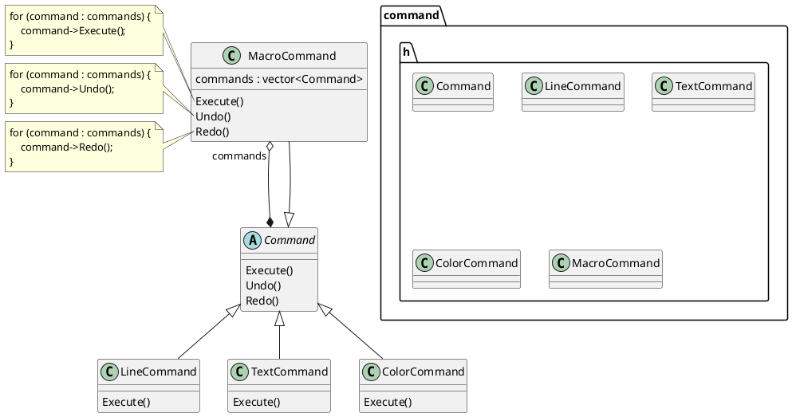
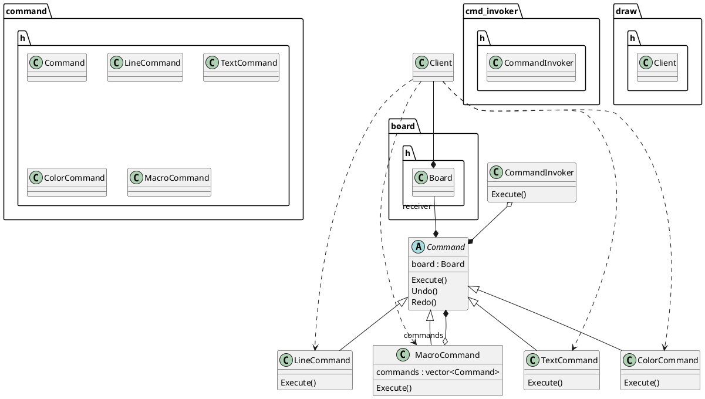
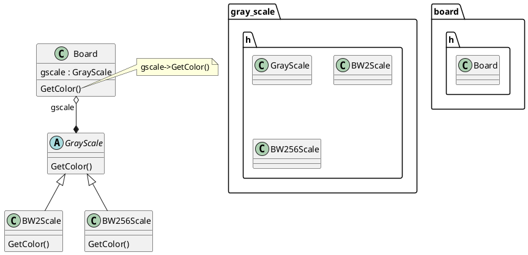
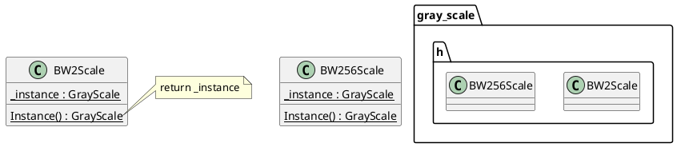

# Design Patterns Used in this Lab

Here's 4 main design patterns used in this Lab:

## Composite
**Composite** is used to build the `Command` abstract class, and its subclasses `LineCommand`, `TextCommand` and `ColorCommand`, `MacroCommand`, where `MacroCommand` includes a vector containing multiple `Command`s.
 

 
 
 
 

## Command
**Command** is used to organize how the commands are invoked to apply to its receicer by the client. It also facilitates the Undo() and Redo() methods.

 
 
 
 
 
 
 
 
 
 

## State
**State** is used to help `Board` to switch between two gray scale modes according to the command line parameters, [-g 2] or [-g 256].

## Singleton
**Singleton** is used because gray scale modes only need one instance each.

